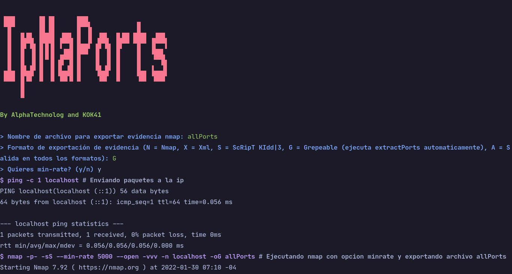

# IpMaPorts

Automatize all your first h4cking thinks with one shell line



## Installation

To install ipmaports you can do this command in your terminal.

```sh
curl https://raw.githubusercontent.com/H4ckTools/ipmaports/main/install.sh --silent | bash
```

And then the installator will be make all for you

## Uninstallation

To uninstall ipmaports you can do this command in your terminal.

```sh
curl https://raw.githubusercontent.com/H4ckTools/ipmaports/main/uninstall.sh --silent | bash
```

And then the uninstallator will be make all for you

## Basic usage

The basic usage for ipmaports is only one paremeter, the ip.

```sh
ipmaports <ip>
```

Example:

```sh
ipmaports localhost # or any other ip, consider ipmaports will be make some nmaps and others scans (use only with your own systems)
```

## Asking the questions

IpMaPorts will be make some questions for you, like if you want min-rate, the exportation file, the
exportation format, etc. Example:

```sh
 ▄▄▄      ▗▄ ▄▖     ▗▄▄▖                     
 ▀█▀      ▐█ █▌     ▐▛▀▜▖           ▐▌       
  █  ▐▙█▙ ▐███▌ ▟██▖▐▌ ▐▌ ▟█▙  █▟█▌▐███ ▗▟██▖
  █  ▐▛ ▜▌▐▌█▐▌ ▘▄▟▌▐██▛ ▐▛ ▜▌ █▘   ▐▌  ▐▙▄▖▘
  █  ▐▌ ▐▌▐▌▀▐▌▗█▀▜▌▐▌   ▐▌ ▐▌ █    ▐▌   ▀▀█▖
 ▄█▄ ▐█▄█▘▐▌ ▐▌▐▙▄█▌▐▌   ▝█▄█▘ █    ▐▙▄ ▐▄▄▟▌
 ▀▀▀ ▐▌▀▘ ▝▘ ▝▘ ▀▀▝▘▝▘    ▝▀▘  ▀     ▀▀  ▀▀▀ 
     ▐▌                                      

By AlphaTechnolog and KOK41

> Nombre de archivo para exportar evidencia nmap: allPorts
> Formato de exportación de evidencia (N = Nmap, X = Xml, S = ScRipT KIdd|3, G = Grepeable (ejecuta extractPorts automaticamente), A = Salida en todos los formatos): G
> Quieres min-rate? (y/n) y
$ ping -c 1 localhost # Enviando paquetes a la ip
PING localhost(localhost (::1)) 56 data bytes
64 bytes from localhost (::1): icmp_seq=1 ttl=64 time=0.056 ms

--- localhost ping statistics ---
1 packets transmitted, 1 received, 0% packet loss, time 0ms
rtt min/avg/max/mdev = 0.056/0.056/0.056/0.000 ms
$ nmap -p- -sS --min-rate 5000 --open -vvv -n localhost -oG allPorts # Ejecutando nmap con opcion minrate y exportando archivo allPorts
Starting Nmap 7.92 ( https://nmap.org ) at 2022-01-30 07:10 -04
Warning: Hostname localhost resolves to 2 IPs. Using 127.0.0.1.
Initiating SYN Stealth Scan at 07:10
Scanning localhost (127.0.0.1) [65535 ports]
Discovered open port 6463/tcp on 127.0.0.1
Completed SYN Stealth Scan at 07:10, 1.14s elapsed (65535 total ports)
Nmap scan report for localhost (127.0.0.1)
Host is up, received localhost-response (0.0000080s latency).
Other addresses for localhost (not scanned): ::1
Scanned at 2022-01-30 07:10:35 -04 for 2s
Not shown: 65534 closed tcp ports (reset)
PORT     STATE SERVICE REASON
6463/tcp open  unknown syn-ack ttl 64

Read data files from: /usr/bin/../share/nmap
Nmap done: 1 IP address (1 host up) scanned in 1.32 seconds
           Raw packets sent: 65535 (2.884MB) | Rcvd: 131071 (5.505MB)
Intentando extraer puertos con extractPorts (por s4vitar)

[*] Extracting information...

	[*] IP Address: 127.0.0.1
	[*] Open ports: 6463

[*] Ports copied to clipboard

OK, intenta usar Ctrl + Shift + V para pegar los puertos.
ipmaports  main [?] 11s ❯
```

In the example you can view, that I put this credentials in the program:

- `ip: localhost`
- `filename: allPorts`
- `format: Grepeable`
- `useMinRate: yes`

And the program execute the nmap scannings and a ping and export a file named
allPorts with the port, and additionaly execute the `extractPorts` script by
[s4vitar](https://github.com/s4vitar), that copy the ports with a grepeable
nmap evidencies file.

If the format is grepeable, the program will be copy the opened ports with
the `extractPorts`.
